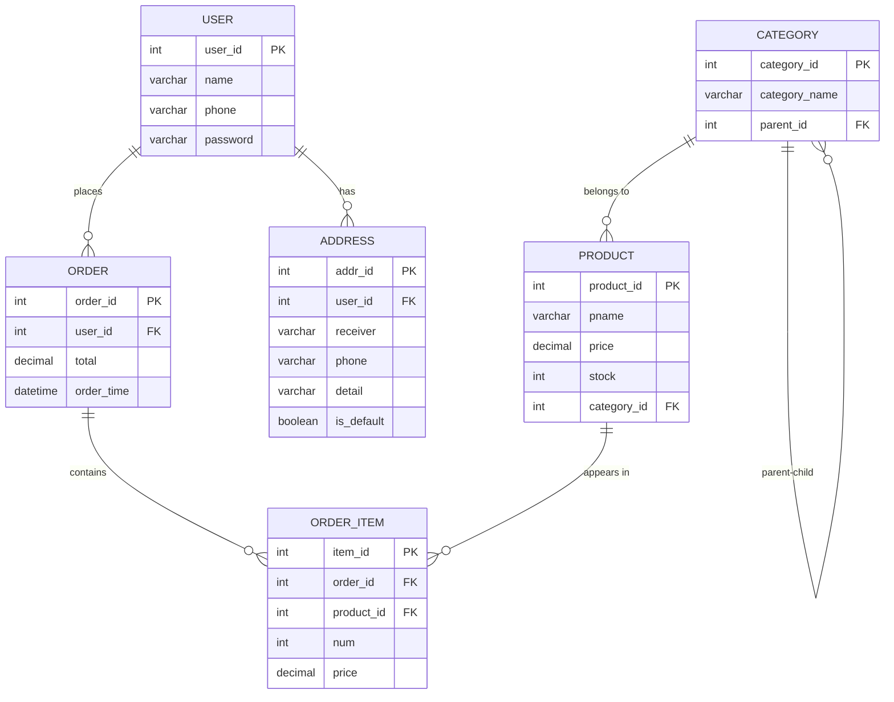

# E-Commerce Database System

English | [中文](README.zh-CN.md)

A MySQL-based database system design project that models core e-commerce business scenarios, including user management, product catalog, order processing, and address management.

## Project Overview

This project demonstrates the process of translating real-world business requirements into a structured relational database design. Starting from analyzing e-commerce business flows, I worked through entity identification, relationship modeling, normalization, and finally implemented the schema in MySQL with sample data and queries.

The goal was not just to write SQL, but to understand **how to think about data** — what entities exist, how they relate, and how to design a schema that stays consistent as business logic grows more complex.

## Features

- **User Management** — User registration, authentication data storage
- **Product Catalog** — Products with pricing, inventory tracking, and hierarchical category classification
- **Order Processing** — Order creation with line items, supporting multiple products per order
- **Address Management** — Multiple addresses per user with default address marking
- **Category Hierarchy** — Self-referencing category tree for flexible product classification
- **Query Analytics** — Sales statistics, user order history, inventory analysis
- **Data Views** — Pre-built views for common access patterns

## Tech Stack

| Component | Technology |
|-----------|------------|
| Database | MySQL 8.0 |
| Language | SQL |
| Modeling | ER Modeling, Relational Schema Design |
| Design Principles | Normalization (up to 3NF), Referential Integrity |

## Database Design

### Entity-Relationship Diagram



### Tables Overview

| Table | Description | Key Relationships |
|-------|-------------|-------------------|
| `user` | System users | Primary entity |
| `product` | Products for sale | References `category` |
| `order` | Purchase orders | References `user` |
| `order_item` | Line items within orders | References `order` and `product` |
| `address` | User shipping addresses | References `user` |
| `category` | Product categories (hierarchical) | Self-referencing via `parent_id` |

### Key Design Decisions

1. **Many-to-Many Resolution**: The relationship between `order` and `product` is resolved through the `order_item` junction table, which also stores the quantity and price at time of purchase.

2. **Category Hierarchy**: Categories use a self-referencing `parent_id` to form a tree structure, allowing unlimited nesting depth.

3. **Price Snapshot**: `order_item.price` records the price at purchase time, decoupling historical orders from current product pricing.

4. **Default Address**: The `is_default` flag in `address` allows quick retrieval of a user's primary shipping address.

## Project Structure

```
E-Commerce-Database-System/
├── README.md
├── LICENSE
├── .gitignore
│
├── sql/
│   ├── schema.sql          # Database and table creation
│   ├── seed.sql            # Sample data insertion
│   ├── queries.sql         # SELECT queries (joins, subqueries, aggregation)
│   ├── operations.sql      # INSERT, UPDATE, DELETE operations
│   └── views.sql           # View definitions
│
├── docs/
│   ├── database_design.pdf # Original design document
│   ├── schema_description.md
│   ├── business_logic.md
│   └── normalization_notes.md
│
├── assets/
│   ├── er_diagram.md       # ER diagram in Mermaid format
│   └── screenshots/
│
└── demo/
    └── introduction.mp4    # Project demonstration video
```

## Representative SQL Examples

### 1. Multi-Table Join — Order Details

Retrieve complete order information by joining orders, users, and order items:

```sql
SELECT `order`.user_id, order_item.product_id, order_item.num, order_item.price
FROM ecommerce.`order`
LEFT JOIN ecommerce.order_item ON `order`.order_id = order_item.order_id;
```

This query uses a LEFT JOIN to ensure all orders are returned even if they have no items yet — important for data integrity checks.

### 2. Subquery Chain — Find Users Who Purchased a Specific Product

```sql
SELECT `name`
FROM ecommerce.`user`
WHERE user_id IN (
    SELECT user_id
    FROM ecommerce.`order`
    WHERE order_id IN (
        SELECT order_id
        FROM ecommerce.order_item
        WHERE product_id = (
            SELECT product_id
            FROM ecommerce.product
            WHERE pname = "蓝牙耳机"
        )
    )
);
```

This demonstrates nested subqueries working from the inside out: find the product ID, then the order IDs containing it, then the user IDs for those orders, and finally the user names.

### 3. Aggregation with Group By — Inventory Summary

```sql
SELECT product_id, pname, SUM(stock)
FROM ecommerce.product
GROUP BY product_id, pname;
```

### 4. Business Logic in SQL — Inventory Update on Order

```sql
UPDATE ecommerce.product
INNER JOIN ecommerce.order_item ON product.product_id = order_item.product_id
SET product.stock = product.stock - order_item.num
WHERE order_item.order_id = 1005;
```

This implements a core business rule: when an order is placed, product inventory must decrease by the ordered quantity. The UPDATE with JOIN ensures atomic modification.

### 5. Referential Integrity — Order Cancellation

```sql
-- Must delete order items first (foreign key dependency)
DELETE FROM ecommerce.order_item WHERE order_id = 1003;
DELETE FROM ecommerce.`order` WHERE order_id = 1003;
```

Order cancellation requires deleting child records (order items) before parent records (order) to maintain referential integrity.

### 6. View Creation — User Order Overview

```sql
CREATE VIEW user_order AS
SELECT `user`.user_id, `user`.`name`, `user`.`phone`,
       `order`.order_id, `order`.order_time, `order`.total
FROM ecommerce.`user`
LEFT JOIN ecommerce.`order` ON `user`.user_id = `order`.user_id;
```

Views encapsulate common query patterns, providing a simplified interface for frequent data access needs.

## Business Logic

### Core Business Flow

```
User Registration → Browse Products → Place Order → Order Processing
     ↓                    ↓               ↓              ↓
  user table         product table    order table    order_item table
                           ↓               ↓
                    category table    address table
```

### Key Business Rules

1. **Order Creation**: When a user places an order, the system creates an order record and associated order items. Each order item captures the product, quantity, and price at time of purchase.

2. **Inventory Management**: Product stock decreases when an order is placed. This is implemented through an UPDATE with JOIN operation.

3. **Order Cancellation**: Canceling an order requires deleting order items first (due to foreign key constraints), then deleting the order itself. This maintains referential integrity.

4. **Address Management**: Users can have multiple addresses, with one marked as default for quick checkout.

5. **Category Hierarchy**: Products belong to categories, which can have parent categories, forming a tree structure for flexible classification.

## Views

The project includes 5 pre-built views for common access patterns:

| View | Purpose |
|------|---------|
| `user_order` | User-order overview for customer service |
| `product_order_item` | Product sales statistics |
| `product_details` | Complete order item details with product info |
| `user_addr` | User default address lookup |
| `product_category` | Product-category mapping |

## Learning Summary

When I started this project, I thought database design was mostly about writing correct SQL syntax. I was wrong.

The real challenge was figuring out how to model the business domain. For example, the order system seemed simple at first — just link users to products. But then I realized: what if a user orders multiple products in one order? What if the product price changes after the order is placed? What if we need to track quantity per item?

This led me to the order_item junction table, which resolved the many-to-many relationship between orders and products while also storing the snapshot of price at purchase time. It was a lesson in thinking about data relationships before writing any SQL.

Another learning moment came from the category hierarchy. I initially tried to use a flat structure, but quickly ran into limitations. The self-referencing parent_id pattern was elegant, but it made queries more complex — especially when I needed to find all products under a category and its subcategories.

The most humbling part was understanding foreign key constraints during order cancellation. I learned the hard way that you can't delete an order if order items still reference it. This taught me to think about data dependencies and the order of operations.

Overall, this project taught me that good database design is about asking the right questions: What entities exist? How do they relate? What happens when data changes? The SQL syntax is just the implementation detail.

## Future Improvements

- [ ] Add stored procedures for complex business operations
- [ ] Implement triggers for automatic inventory management
- [ ] Add indexes for query performance optimization
- [ ] Implement transaction handling for multi-step operations
- [ ] Add user role and permission management
- [ ] Create a simple REST API layer for database interaction
- [ ] Add data validation constraints at the database level
- [ ] Implement soft delete for data retention

## How to Use

### Prerequisites

- MySQL 8.0 or higher
- MySQL client (MySQL Workbench, command line, or any SQL client)

### Setup

1. Clone the repository:
   ```bash
   git clone https://github.com/yourusername/E-Commerce-Database-System.git
   cd E-Commerce-Database-System
   ```

2. Execute the SQL files in order:
   ```bash
   mysql -u root -p < sql/schema.sql
   mysql -u root -p ecommerce < sql/seed.sql
   mysql -u root -p ecommerce < sql/views.sql
   ```

3. Run queries:
   ```bash
   mysql -u root -p ecommerce < sql/queries.sql
   ```

## License

This project is licensed under the MIT License - see the [LICENSE](LICENSE) file for details.
