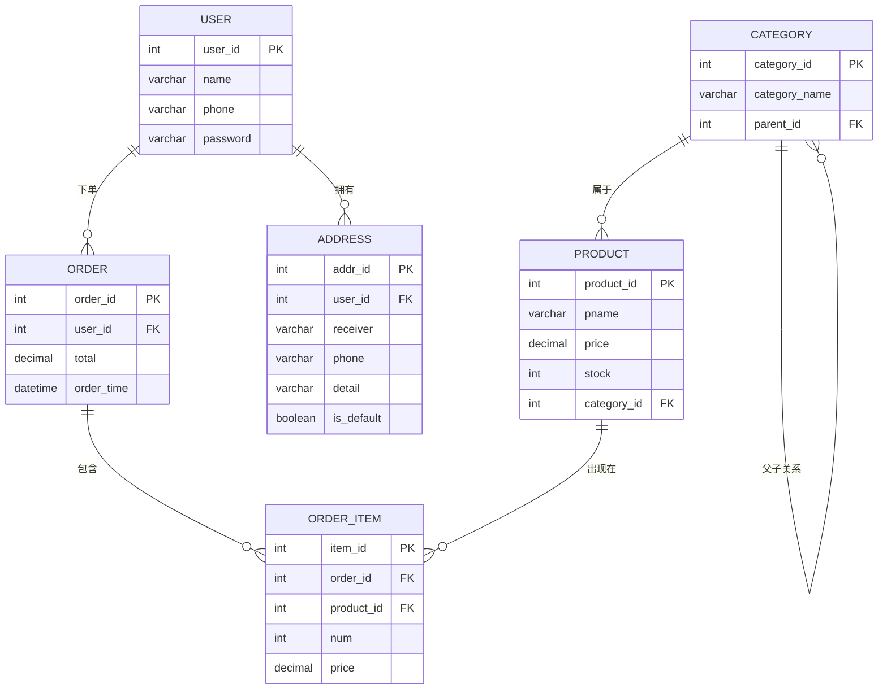

# 电商数据库系统

一个基于 MySQL 的电商数据库系统设计项目，涵盖用户管理、商品目录、订单处理和地址管理等核心业务场景。

## 项目概述

这个项目展示了如何将现实世界的业务需求转化为结构化的关系数据库设计。从分析电商业务流程开始，我逐步完成了实体识别、关系建模、规范化设计，最终在 MySQL 中实现了完整的数据库模式，并编写了示例数据和查询。

目标不仅仅是写出正确的 SQL，而是理解**如何思考数据**——存在哪些实体、它们之间如何关联、以及如何设计一个在业务逻辑变复杂时仍然保持一致性的数据库模式。

## 功能模块

- **用户管理** — 用户注册、认证数据存储
- **商品目录** — 商品定价、库存跟踪、层级分类
- **订单处理** — 订单创建与明细项，支持单订单多商品
- **地址管理** — 每个用户可有多个地址，支持默认地址标记
- **分类层级** — 自引用分类树，支持灵活的商品分类
- **查询分析** — 销售统计、用户订单历史、库存分析
- **数据视图** — 预定义视图，简化常用数据访问

## 技术栈

| 组件 | 技术 |
|------|------|
| 数据库 | MySQL 8.0 |
| 语言 | SQL |
| 建模 | ER 建模、关系模式设计 |
| 设计原则 | 规范化（至 3NF）、参照完整性 |

## 数据库设计

### ER 图



### 数据表概览

| 表名 | 说明 | 核心关系 |
|------|------|----------|
| `user` | 系统用户 | 主实体 |
| `product` | 商品 | 引用 `category` |
| `order` | 订单 | 引用 `user` |
| `order_item` | 订单明细项 | 引用 `order` 和 `product` |
| `address` | 用户收货地址 | 引用 `user` |
| `category` | 商品分类（层级结构） | 通过 `parent_id` 自引用 |

### 关键设计决策

1. **多对多关系拆解**：`order` 和 `product` 之间通过 `order_item` 中间表关联，同时记录购买时的数量和价格。

2. **分类层级**：分类表使用自引用的 `parent_id` 形成树形结构，支持无限层级嵌套。

3. **价格快照**：`order_item.price` 记录下单时的价格，使历史订单不受后续商品调价影响。

4. **默认地址**：`address` 表的 `is_default` 字段可快速获取用户的首选收货地址。

## 项目结构

```
Database-Design/
├── README.md                    # 项目文档
├── LICENSE                      # MIT 开源协议
├── .gitignore                   # Git 忽略规则
│
├── sql/
│   ├── schema.sql              # 建库建表
│   ├── seed.sql                # 示例数据
│   ├── queries.sql             # SELECT 查询（连接、子查询、聚合）
│   ├── operations.sql          # INSERT/UPDATE/DELETE 操作
│   └── views.sql               # 视图定义
│
├── docs/
│   ├── database_design.pdf     # 原始设计文档
│   ├── schema_description.md   # 数据表详细说明
│   ├── business_logic.md       # 业务逻辑说明
│   └── normalization_notes.md  # 规范化分析
│
├── assets/
│   └── er_diagram.md           # ER 图（Mermaid 格式）
│
└── demo/
    └── introduction.mp4        # 项目演示视频
```

## 典型 SQL 示例

### 1. 多表连接 — 订单详情

通过连接订单表、用户表和订单项表，获取完整的订单信息：

```sql
SELECT `order`.user_id, order_item.product_id, order_item.num, order_item.price
FROM ecommerce.`order`
LEFT JOIN ecommerce.order_item ON `order`.order_id = order_item.order_id;
```

使用 LEFT JOIN 确保即使订单没有明细项也能返回，这对于数据完整性检查很重要。

### 2. 子查询链 — 查找购买过特定商品的用户

```sql
SELECT `name`
FROM ecommerce.`user`
WHERE user_id IN (
    SELECT user_id
    FROM ecommerce.`order`
    WHERE order_id IN (
        SELECT order_id
        FROM ecommerce.order_item
        WHERE product_id = (
            SELECT product_id
            FROM ecommerce.product
            WHERE pname = "蓝牙耳机"
        )
    )
);
```

展示了嵌套子查询的工作方式：从内向外依次查找商品 ID、包含该商品的订单 ID、对应订单的用户 ID，最后获取用户名。

### 3. 聚合查询 — 库存统计

```sql
SELECT product_id, pname, SUM(stock)
FROM ecommerce.product
GROUP BY product_id, pname;
```

### 4. 业务逻辑实现 — 下单后更新库存

```sql
UPDATE ecommerce.product
INNER JOIN ecommerce.order_item ON product.product_id = order_item.product_id
SET product.stock = product.stock - order_item.num
WHERE order_item.order_id = 1005;
```

实现了一个核心业务规则：下单后商品库存按购买数量减少。使用 UPDATE JOIN 确保原子操作。

### 5. 参照完整性 — 取消订单

```sql
-- 必须先删除订单项（外键依赖）
DELETE FROM ecommerce.order_item WHERE order_id = 1003;
DELETE FROM ecommerce.`order` WHERE order_id = 1003;
```

取消订单时必须先删除子记录（订单项），再删除父记录（订单），以维护参照完整性。

### 6. 视图创建 — 用户订单概览

```sql
CREATE VIEW user_order AS
SELECT `user`.user_id, `user`.`name`, `user`.`phone`,
       `order`.order_id, `order`.order_time, `order`.total
FROM ecommerce.`user`
LEFT JOIN ecommerce.`order` ON `user`.user_id = `order`.user_id;
```

视图封装了常用的查询模式，为频繁的数据访问需求提供简化的接口。

## 业务逻辑

### 核心业务流程

```
用户注册 → 浏览商品 → 下单购买 → 订单处理
   ↓           ↓          ↓          ↓
用户表      商品表      订单表    订单项表
              ↓           ↓
           分类表      地址表
```

### 关键业务规则

1. **订单创建**：用户下单时，系统创建订单记录和关联的订单项。每个订单项记录商品、数量和下单时的价格。

2. **库存管理**：下单后商品库存减少，通过 UPDATE JOIN 操作实现。

3. **订单取消**：取消订单需要先删除订单项（外键约束），再删除订单本身，以维护参照完整性。

4. **地址管理**：用户可拥有多个地址，其中一个标记为默认地址，方便快速结算。

5. **分类层级**：商品属于分类，分类可有父分类，形成树形结构实现灵活分类。

## 视图

项目包含 5 个预定义视图，用于常见的数据访问模式：

| 视图 | 用途 |
|------|------|
| `user_order` | 用户订单概览，便于客服查询 |
| `product_order_item` | 商品销售统计 |
| `product_details` | 订单商品明细，包含完整商品信息 |
| `user_addr` | 用户默认地址查询 |
| `product_category` | 商品分类映射 |

## 学习总结

刚开始做这个项目的时候，我以为数据库设计主要是写对 SQL 语法。后来发现不是。

真正的难点在于如何对业务领域建模。比如订单系统看起来很简单——把用户和商品关联起来就行了。但仔细一想：一个用户可能一次买多个商品怎么办？商品价格在下单后变了怎么办？需要记录每个商品的购买数量怎么办？

这就引出了 order_item 中间表，它不仅解决了订单和商品之间的多对多关系，还保存了下单时的价格快照。这让我学到一个教训：先想清楚数据关系，再写 SQL。

另一个学习点来自分类层级。一开始我想用扁平结构，很快发现行不通。自引用的 parent_id 模式很优雅，但查询变复杂了——特别是需要查找某个分类及其所有子分类下的商品时。

最让我印象深刻的是取消订单时的外键约束。一开始直接删订单，报错了才发现必须先删订单项。这教会了我思考数据依赖和操作顺序。

总的来说，这个项目让我明白：好的数据库设计在于问对问题——存在哪些实体？它们如何关联？数据变化时会发生什么？SQL 语法只是实现细节。

## 后续改进

- [ ] 添加存储过程处理复杂业务操作
- [ ] 实现触发器自动管理库存
- [ ] 添加索引优化查询性能
- [ ] 实现事务处理确保多步操作的原子性
- [ ] 添加用户角色和权限管理
- [ ] 创建简单的 REST API 接口
- [ ] 在数据库层面添加数据验证约束
- [ ] 实现软删除保留历史数据

## 使用方法

### 环境要求

- MySQL 8.0 或更高版本
- MySQL 客户端（MySQL Workbench、命令行或其他 SQL 客户端）

### 安装步骤

1. 克隆仓库：
   ```bash
   git clone https://github.com/FateDefier/Database-Design.git
   cd Database-Design
   ```

2. 按顺序执行 SQL 文件：
   ```bash
   mysql -u root -p < sql/schema.sql
   mysql -u root -p ecommerce < sql/seed.sql
   mysql -u root -p ecommerce < sql/views.sql
   ```

3. 运行查询：
   ```bash
   mysql -u root -p ecommerce < sql/queries.sql
   ```

## 开源协议

本项目基于 MIT 协议开源，详见 [LICENSE](LICENSE) 文件。
