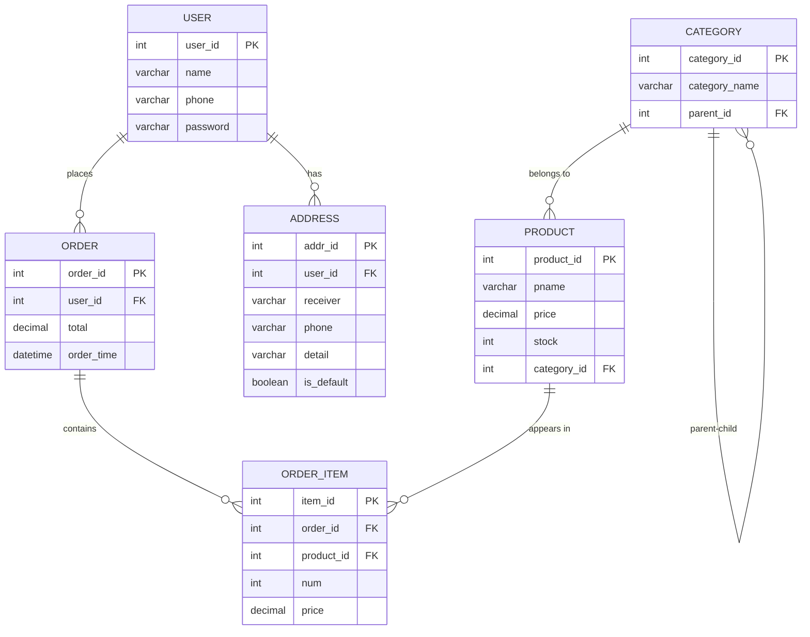

# ER Diagram - E-Commerce Database System

## Relationship Summary

| Relationship | Type | Description |
|--------------|------|-------------|
| USER → ORDER | One-to-Many | A user can place multiple orders |
| USER → ADDRESS | One-to-Many | A user can have multiple addresses |
| ORDER → ORDER_ITEM | One-to-Many | An order can contain multiple items |
| PRODUCT → ORDER_ITEM | One-to-Many | A product can appear in multiple order items |
| CATEGORY → PRODUCT | One-to-Many | A category can contain multiple products |
| CATEGORY → CATEGORY | Self-referencing | Categories can have parent categories (hierarchy) |
