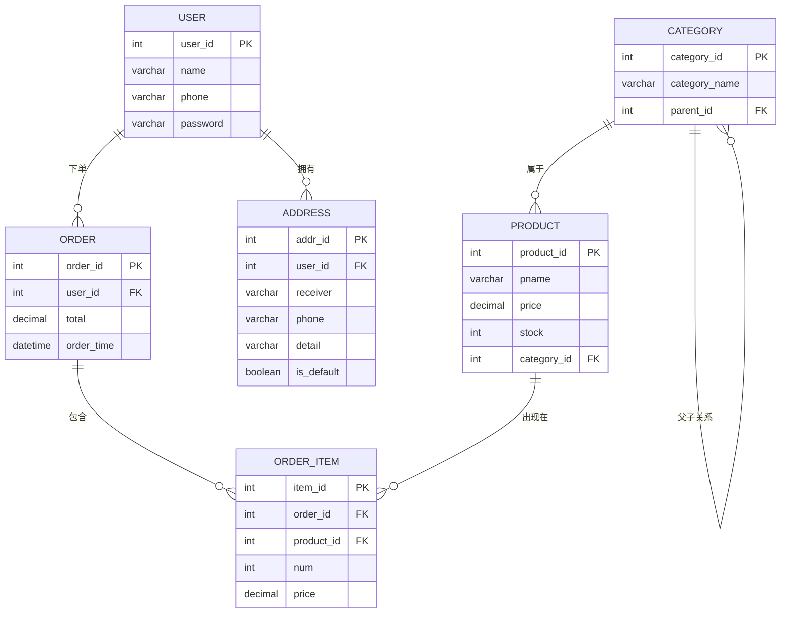

# ER 图 — 电商数据库系统

## 关系汇总

| 关系 | 类型 | 说明 |
|------|------|------|
| USER → ORDER | 一对多 | 一个用户可以有多个订单 |
| USER → ADDRESS | 一对多 | 一个用户可以有多个地址 |
| ORDER → ORDER_ITEM | 一对多 | 一个订单可以有多个订单项 |
| PRODUCT → ORDER_ITEM | 一对多 | 一个商品可以出现在多个订单项中 |
| CATEGORY → PRODUCT | 一对多 | 一个分类可以包含多个商品 |
| CATEGORY → CATEGORY | 自引用 | 分类可以有父分类（层级结构） |
